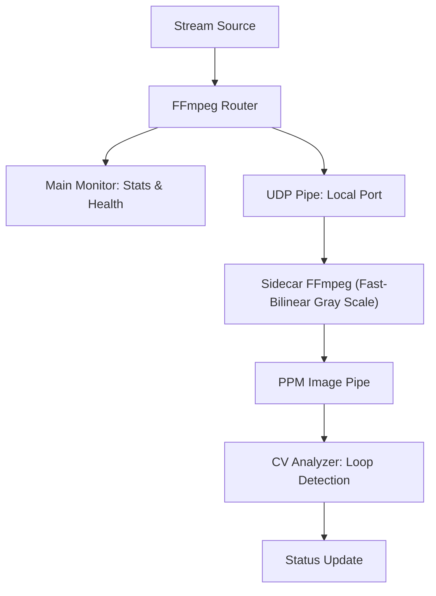
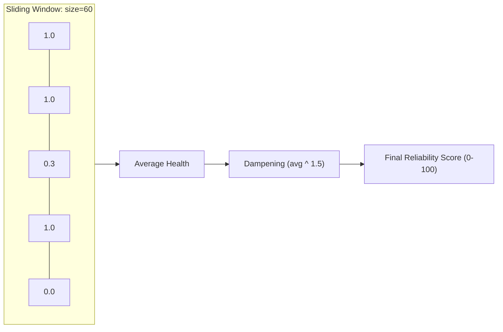
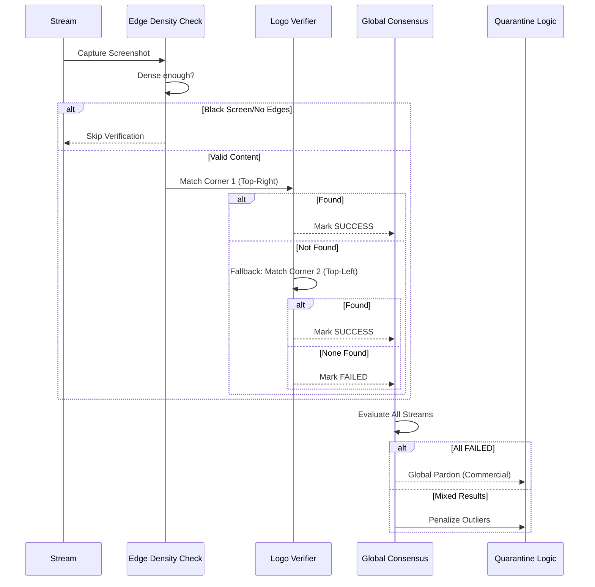

# Stream Monitoring

## Overview
Stream Monitoring is a live health tracking system that runs independently of the main automation pipeline. It maintains a session for each active stream and continuously evaluates quality, reliability, and content accuracy using a multi-layered approach.

---

## 1. FFmpeg Router & Sidecars
The system employs an efficient "Main + Sidecar" architecture for each monitored stream:

- **Main Monitor ([FFmpegStreamMonitor](file:///Users/anderregidor/AceStream%20Project/streamflow/backend/ffmpeg_stream_monitor.py#43-419))**: Captures high-level telemetry like bitrate, FPS, and speed. It uses health monitoring outputs to detect buffering or terminal failures.
- **Sidecar Detectors**: Specialized processes spawned alongside the main monitor to perform computationally intensive tasks without blocking the telemetry loop.

### Sidecar Mechanism Workflow

---

## 2. Looping Detection Mechanism
The loop detector analyzes frames in the PPM pipe. It maintains a short-term buffer of frame signatures (simplified as grayscale signatures) and checks for repeating sequences that indicate a stream is "looping".

- **Penalty**: 50 points are deducted from the reliability score immediately upon loop detection.
- **Quarantine**: If a stream is confirmed to be looping, it is marked as [looping](file:///Users/anderregidor/AceStream%20Project/streamflow/backend/sidecar_loop_detector.py#46-49) and moved to quarantine.

---

## 3. Stability Score: Capped Sliding Window
Reliability is measured using the **Capped Sliding Window** algorithm. This ensures that scores reflect recent performance while dampening sudden variance to prevent "flapping" in Dispatcharr.

### Scoring Mechanism
- **Healthy Measurement**: Stream alive + Speed > 0.9x = **1.0 points**
- **Buffering Measurement**: Stream alive + Speed < 0.9x = **0.3 points**
- **Dead Measurement**: Stream dead = **0 points**

---

## 4. Logo Detection: 4-Pillar Architecture
The logo verification system ensures the content matches the expected channel using a resilient 4-pillar CV system:
1. **Edge Density**: Skips verification on black screens or whip-pans to avoid false negatives.
2. **Multi-Corner Fallback**: Checks top-right; falls back to top-left if needed.
3. **Cross-Stream Consensus**: Grants a "Global Pardon" during commercial breaks if all streams fail simultaneously.
4. **Auto-Quarantine**: Outliers failing 4 consecutive checks are immediately quarantined.

---

## 5. Lifecycle: Quarantine & Review
- **Stable**: Reliable streams ranked by score and resolution.
- **Review**: Streams in "probation" after recovery or initial start.
- **Quarantined**: Streams showing wrong content or dead. Includes specific UI badges for `Looping` (with duration) and `Logo Mismatch` (with screenshot).

---

## 6. Efficiency & Stability
The system is optimized for high-performance monitoring:

- **Threaded Synchronization**: Rank updates to Dispatcharr are threaded to prevent blocking telemetry.
- **Log Debouncing**: Penalty warnings are throttled to 1/minute per stream.
- **Unified Evaluation**: Synchronized timestamps ensure metric alignment across the session.

---

## 7. Monitoring Dashboard & Visibility
- **Logo Verify Status**: Shows CV status (SUCCESS/FAILED/PENDING) and failure counts.
- **Quarantine Badges**: Shows specific reasons like `Looping (15.5s)` or `Logo Mismatch` (with failing screenshot).
- **Live Previews**: Horizontally-scrolling carousel of live screenshots across all active streams.
